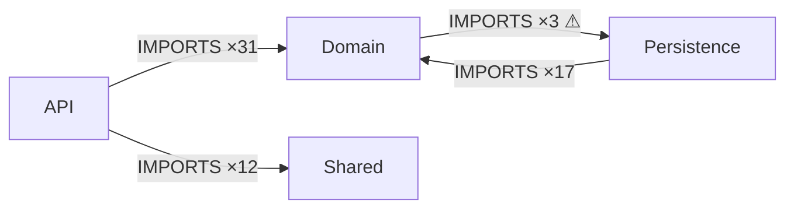

# ArchGraph MVP — Design Document

**Status:** implementation-ready MVP design  
**Date:** 2026-09-24  
**Working name / binary:** `archgraph`  
**Primary implementation language:** Rust  
**Architecture source:** `architecture.yaml`  
**Code-graph provider (MVP):** GitNexus CLI  

> `archgraph` is used instead of `arch` because `arch` is already a common Unix command.

---

## 1. Summary

ArchGraph is a small local architecture compiler placed on top of GitNexus.

GitNexus discovers the **actual code graph** from an existing repository. ArchGraph stores the **intended logical architecture** in a human- and agent-editable YAML file, maps real source files into recursively nested logical nodes, projects GitNexus dependencies onto that logical hierarchy, and checks architectural constraints.

The central model is not C4 and has no fixed number of levels. Architecture is a recursive hierarchy of arbitrary depth plus typed graph edges.

The MVP is intentionally scoped to **one source repository / one application**. It must work regardless of whether the repository is primarily Python, Rust, C/C++, or another language supported by GitNexus, because language parsing and symbol resolution remain GitNexus responsibilities.

The MVP has two equal consumers:

1. **Human** — explores the architecture top-down through a local focus-based UI.
2. **AI coding agent** — invokes a small deterministic CLI and receives concise Markdown or JSON context suitable for refactoring.

The main loop is:

```text
source code
   │
   │ gitnexus analyze
   ▼
GitNexus actual code graph
   │
   │ IMPORTS edges + file identities
   ▼
ArchGraph compiler  ◄──────── architecture.yaml
   │
   ├── compiled architecture IR
   ├── aggregated dependency graph
   ├── architecture violations
   ├── human projection / UI
   └── agent projection / CLI context
```

The desired development workflow is:

```text
inspect architecture
      ↓
change architecture.yaml OR choose an existing violation
      ↓
archgraph context <node>
      ↓
agent refactors code
      ↓
gitnexus analyze --index-only
      ↓
archgraph check
      ↓
repeat until clean
```

---

## 2. Problem

Existing spec-first tools are poorly suited to very large or deeply nested systems because their specifications are often flat or organized around a fixed workflow rather than an arbitrary recursive architecture.

C4 is useful as a visualization convention but is intentionally based on four named zoom levels. For this product, fixed levels are the wrong underlying data model.

The required model is:

```text
Node
 ├── Node
 │    ├── Node
 │    │    ├── Node
 │    │    └── ...
 │    └── Node
 └── Node
```

with typed edges such as:

```text
A --IMPORTS----> B
A --CALLS------> B      # future
A --HTTP-------> B      # manual in MVP
A --DYNAMIC_LINK--> B   # manual in MVP
```

A node can be treated as a black box at one zoom level and expanded into its children at another zoom level.

For example:

```text
Application
 ├── Billing
 │    ├── API
 │    ├── Domain
 │    └── Persistence
 └── Authentication
```

At the `Application` focus, only `Billing` and `Authentication` need to be visible. At the `Billing` focus, `API`, `Domain`, and `Persistence` become visible. At the deepest architecture leaf, files become visible. Symbol/function/AST drill-down is deliberately left to GitNexus in MVP and can be integrated later without changing the architecture source format.

The product must also distinguish:

- **actual structure** discovered from source code;
- **desired logical structure** authored by a human or AI;
- **rules** defining which actual dependencies are valid;
- **evidence** linking each architectural edge or violation back to real source files.

---

## 3. Goals

### 3.1 Primary goals

The MVP MUST:

1. Work on an existing local Git repository.
2. Use GitNexus as an external code-graph provider instead of implementing language parsers.
3. Keep the architecture source of truth in a small version-controlled YAML file.
4. Support arbitrary architecture depth using dotted node IDs.
5. Allow logical architecture to differ from the filesystem structure.
6. Map source files to logical architecture nodes with globs.
7. Consume GitNexus `File -> IMPORTS -> File` dependencies.
8. Aggregate file dependencies to the currently relevant architecture level.
9. Detect architectural rule violations and keep concrete source-file evidence.
10. Support human navigation through a small local web UI.
11. Support agents through stable CLI output in Markdown and JSON.
12. Be deterministic: the same source tree, GitNexus index, and YAML produce the same compiled IR.
13. Fail closed when GitNexus output cannot be understood; never silently convert provider failure into a “clean” architecture report.
14. Keep the GitNexus integration behind an interface so it can later be replaced without changing the architecture format, compiler, rules, UI, or agent workflow.

### 3.2 Secondary goals

The MVP SHOULD:

- be distributed as one Rust binary plus `architecture.yaml`;
- require no application database;
- require no Node.js frontend build pipeline for ArchGraph itself;
- support a manual edge type for relationships GitNexus cannot infer;
- support metadata describing public interfaces exposed by an architecture node;
- generate useful Mermaid output for quick sharing/documentation;
- optionally run `gitnexus analyze --index-only` before a compile/check.

---

## 4. Non-goals for MVP

Do **not** implement the following in v0.1:

- a custom parser for Python, Rust, C, C++, JavaScript, etc.;
- a custom language server or compiler frontend;
- direct LadybugDB access;
- Neo4j or any graph database owned by ArchGraph;
- embeddings or vector search;
- RAG;
- MCP server;
- an in-product AI chat;
- automatic architecture generation by an LLM;
- automatic code mutation/refactoring;
- deployment topology;
- Kubernetes topology;
- runtime process/instance topology;
- multi-repository / microservice composition;
- function-level architecture visualization;
- AST or CFG visualization;
- automatic inference of all external APIs;
- formal API compatibility checking;
- editing architecture by drag-and-drop in the UI.

These can be added later. The MVP must prove the core loop: **code graph + recursive desired architecture + constraints + evidence + agent context**.

---

## 5. Key design decisions

### 5.1 The architecture source is not the code graph

GitNexus owns the discovered code graph. ArchGraph does not copy GitNexus as a product.

ArchGraph owns only:

- logical architecture nodes;
- hierarchy;
- file-to-node membership;
- manual edges;
- interfaces/metadata;
- architectural rules;
- projections and violations.

### 5.2 Hierarchy is arbitrary-depth

There are no built-in `System`, `Container`, `Component`, or `Code` levels.

A node ID encodes containment:

```text
app
app.billing
app.billing.api
app.billing.domain
app.billing.persistence
```

This produces:

```text
app
└── billing
    ├── api
    ├── domain
    └── persistence
```

Depth is unlimited by the data model.

### 5.3 Dotted IDs instead of deeply nested YAML

The YAML stays patch-friendly for humans and AI agents. Moving or adding a node should not require rewriting a large nested YAML subtree.

### 5.4 Architecture nodes are logical, not filesystem nodes

A node can own files from arbitrary directories.

```yaml
nodes:
  app.billing:
    maps:
      - src/controllers/billing_controller.py
      - src/services/billing/**
      - src/persistence/invoice/**
```

This allows the architecture to represent the target design even before the physical repository is reorganized.

### 5.5 Actual and desired graphs remain separate

Actual graph:

```text
file A --IMPORTS--> file B
```

Desired architecture:

```text
file A ∈ app.billing.domain
file B ∈ app.billing.persistence

rule:
app.billing.domain -X-> app.billing.persistence
```

Compiler output:

```text
VIOLATION
app.billing.domain -> app.billing.persistence
Evidence: file A -> file B
```

### 5.6 GitNexus is a provider, not a dependency baked into the core

The core depends on:

```rust
trait CodeGraphProvider
```

not on GitNexus internals.

The MVP implementation is:

```text
GitNexusCliProvider
```

A future provider can use Sourcegraph SCIP, compiler databases, a custom parser, or a stable GitNexus API.

### 5.7 Do not use `/api/graph` for compilation

The compiler must not download the entire GitNexus graph through `/api/graph`.

Current GitNexus versions expose direct CLI graph queries. The MVP should query only the relation type it needs and paginate results through Cypher.

This avoids:

- loading symbol/CFG/community/process nodes that the MVP does not need;
- huge JSON/NDJSON graph downloads;
- coupling the compiler to the GitNexus web UI server lifecycle.

### 5.8 No direct LadybugDB integration

Opening GitNexus storage directly would couple ArchGraph to undocumented database files, locking behavior, and schema migrations. The MVP deliberately uses the public GitNexus CLI surface.

### 5.9 GitNexus data is evidence, not proof of completeness

ArchGraph MUST NOT claim that “no dependency exists” merely because GitNexus returned no edge.

Static analysis can miss dynamic imports, reflection, generated code, unusual build systems, or language-specific patterns. Therefore reports should distinguish:

- `observed dependency` — supported by provider evidence;
- `no observed dependency` — no edge was returned;
- never phrase this as a formal proof that no runtime dependency exists.

This matters particularly during refactoring.

---

## 6. Architecture source format

Default path:

```text
architecture.yaml
```

### 6.1 Complete example

```yaml
version: 1

project:
  name: example-app
  root: app
  source_roots:
    - src
  exclude:
    - "**/target/**"
    - "**/.venv/**"
    - "**/__pycache__/**"
    - "**/generated/**"

provider:
  kind: gitnexus
  command: gitnexus
  repo: null
  page_size: 1000

policies:
  unassigned_files: warn
  ambiguous_mapping: error

nodes:
  app:
    title: Application
    description: Main application boundary.

  app.api:
    title: API
    description: External request handling and protocol adapters.
    maps:
      - "src/api/**"
    interfaces:
      - name: Public HTTP API
        kind: http
        direction: provides
        protocol: https
        contract: "/api/*"

  app.domain:
    title: Domain
    description: Business rules; should not know persistence details.
    maps:
      - "src/domain/**"

  app.persistence:
    title: Persistence
    maps:
      - "src/persistence/**"

  app.shared:
    title: Shared
    maps:
      - "src/shared/**"

  external.stripe:
    title: Stripe
    kind: external
    description: External payment provider treated as a black box.
    interfaces:
      - name: Payments API
        kind: http
        direction: provides
        protocol: https

edges:
  - id: stripe-api
    from: app.api
    to: external.stripe
    kind: http
    label: Payments API

rules:
  - id: domain-must-not-import-persistence
    kind: deny_dependency
    from: app.domain
    to: app.persistence
    edge_types:
      - IMPORTS
    include_descendants: true

  - id: domain-allowlist
    kind: allow_only
    from: app.domain
    to:
      - app.shared
    edge_types:
      - IMPORTS
    include_descendants: true

  - id: app-must-not-have-module-cycles
    kind: no_cycles
    within: app
    edge_types:
      - IMPORTS
```

### 6.2 Top-level schema

```text
version      required integer, must be 1
project      required
provider     required for compile/check
policies     optional
nodes        required map<string, Node>
edges        optional list<ManualEdge>
rules        optional list<Rule>
```

### 6.3 `project`

```yaml
project:
  name: string
  root: node-id
  source_roots: [relative/path, ...]
  exclude: [glob, ...]
```

Rules:

- `root` must reference an existing internal architecture node.
- all paths are relative to repository root;
- all normalized paths use `/` separators internally on every OS;
- `source_roots` limits filesystem discovery;
- `.gitignore` should be respected by default.

### 6.4 `provider`

```yaml
provider:
  kind: gitnexus
  command: gitnexus
  repo: optional-repo-name-or-path
  page_size: 1000
```

`command` may be an absolute path.

The environment variable `GITNEXUS_BIN` overrides `provider.command`.

`repo` is optional. When set, pass it to GitNexus via `--repo` / `-r`. When absent, run GitNexus in the repository root and let GitNexus resolve the current repository.

### 6.5 `nodes`

```yaml
nodes:
  app.billing.domain:
    title: Billing Domain
    kind: internal
    description: Billing business logic.
    maps:
      - "src/billing/domain/**"
    interfaces: []
```

Fields:

```text
title         optional string; default is final ID segment
kind          optional: internal | external; default internal
description   optional string
maps          optional list of glob patterns
interfaces    optional list of Interface metadata
```

Containment is derived from dotted IDs.

For `app.billing.domain`, parent is `app.billing`.

Every non-top-level parent must exist. Do not silently create missing parents.

### 6.6 `interfaces`

Interfaces are descriptive in MVP. They are included in UI and agent context but not automatically verified.

```yaml
interfaces:
  - name: Public HTTP API
    kind: http
    direction: provides
    protocol: https
    contract: "/api/billing/*"
    description: Optional text
```

All fields except `name` and `kind` may be optional.

Suggested kinds are not an enum in v0.1. Examples:

```text
http
grpc
cli
native-abi
dynamic-link
sql
topic
file
custom
```

This keeps the data model extensible.

### 6.7 `edges`

Manual edges describe relationships that are not produced by GitNexus or should exist as architectural intent.

```yaml
edges:
  - id: stripe-api
    from: app.billing.api
    to: external.stripe
    kind: http
    label: charge/create
    description: Optional
```

Manual edges are part of the compiled graph and UI.

They do not imply source-code evidence.

### 6.8 File mapping semantics

Each internal architecture node can declare `maps` globs.

The compiler discovers repository files and evaluates every mapping.

Assignment algorithm:

1. Normalize the file path.
2. Find all architecture nodes whose `maps` match the file.
3. If there are no matches, mark the file `unassigned`.
4. If matches form a single ancestor chain, assign the file to the **deepest** matching node.
5. If two or more matches are not ancestor/descendant of one another, the mapping is ambiguous.
6. `policies.ambiguous_mapping: error` makes compilation fail on ambiguity.

Example:

```text
app               maps src/**
app.billing       maps src/billing/**
app.billing.api   maps src/billing/api/**
```

`src/billing/api/routes.py` belongs to `app.billing.api`, not all three nodes.

Parents implicitly own the union of their descendant files for projection purposes.

### 6.9 `policies`

```yaml
policies:
  unassigned_files: ignore | warn | error
  ambiguous_mapping: error | warn
```

Defaults:

```yaml
unassigned_files: warn
ambiguous_mapping: error
```

---

## 7. Rule model

The MVP implements three rules.

### 7.1 `deny_dependency`

```yaml
- id: domain-no-persistence
  kind: deny_dependency
  from: app.domain
  to: app.persistence
  edge_types: [IMPORTS]
  include_descendants: true
```

A violation occurs when an observed code edge originates in the `from` subtree and ends in the `to` subtree.

Evidence includes concrete source file and destination file pairs.

### 7.2 `allow_only`

```yaml
- id: domain-outbound-allowlist
  kind: allow_only
  from: app.domain
  to:
    - app.shared
  edge_types: [IMPORTS]
  include_descendants: true
```

Semantics:

- dependencies whose source and destination both resolve inside the same `from` subtree are allowed;
- dependencies from `from` to any listed target subtree are allowed;
- every other observed outbound dependency of the configured edge type is a violation.

This is intentionally strict and useful for layered architecture.

### 7.3 `no_cycles`

```yaml
- id: no-module-cycles
  kind: no_cycles
  within: app
  edge_types: [IMPORTS]
```

The compiler projects observed edges onto the **immediate children** of `within` and checks the resulting directed graph for strongly connected components.

A self-edge is not considered a cycle at that zoom level because it represents dependencies internal to one child node; the cycle may become visible when that child is opened.

An SCC containing 2+ visible nodes is a violation.

The report should provide representative concrete file-edge evidence for every architecture edge participating in the SCC.

---

## 8. Code graph provider abstraction

Core API concept:

```rust
#[async_trait]
pub trait CodeGraphProvider: Send + Sync {
    async fn info(&self) -> Result<ProviderInfo>;
    async fn import_edges(&self) -> Result<Vec<CodeEdge>>;
}
```

MVP structs conceptually:

```rust
pub struct ProviderInfo {
    pub provider: String,
    pub version: Option<String>,
    pub repository: Option<String>,
}

pub struct CodeEdge {
    pub from_file: String,
    pub to_file: String,
    pub kind: String,          // "IMPORTS" in MVP
    pub confidence: Option<f64>,
    pub reason: Option<String>,
}
```

The core compiler MUST be testable with an in-memory fake provider.

No compiler module may invoke the `gitnexus` process directly. Only `provider/gitnexus.rs` may do that.

---

## 9. GitNexus integration

### 9.1 Expected external setup

GitNexus is an external executable.

Typical setup:

```bash
npm install -g gitnexus@latest
cd /path/to/project
gitnexus analyze --index-only
```

`gitnexus setup` is useful for connecting GitNexus directly to AI editors but is not required by ArchGraph.

### 9.2 Re-index convenience

`archgraph compile`, `check`, and `serve` accept:

```text
--reindex
```

When present, execute:

```bash
gitnexus analyze <repo-root> --index-only
```

before querying the graph.

Do not use `--force` by default.

### 9.3 MVP query strategy

Do not query all graph node types.

Fetch only file-level import edges using a paginated Cypher query equivalent to:

```cypher
MATCH (a:File)-[r:CodeRelation {type: 'IMPORTS'}]->(b:File)
RETURN
  a.filePath AS source,
  b.filePath AS target,
  r.confidence AS confidence,
  r.reason AS reason
ORDER BY source, target
SKIP <offset>
LIMIT <page_size>
```

Invoke without a shell, passing the entire query as a single process argument.

Conceptual command:

```bash
gitnexus cypher '<query>' --repo '<repo>'
```

When `provider.repo` is omitted, set the subprocess working directory to the repository root and omit `--repo`.

### 9.4 Current GitNexus CLI output adapter

Current GitNexus direct CLI commands serialize structured tool output as JSON. The `cypher` tool currently returns a wrapper conceptually shaped as:

```json
{
  "markdown": "| source | target | confidence | reason |\n| --- | --- | --- | --- |\n| ... | ... | ... | ... |",
  "row_count": 1000
}
```

Therefore the MVP adapter must:

1. capture stdout;
2. require process exit status 0;
3. parse stdout as JSON;
4. require `markdown` string and `row_count` integer;
5. parse the Markdown table into typed rows;
6. normalize file paths;
7. request the next page until `row_count < page_size`.

This ugly translation layer is deliberately isolated inside `GitNexusCliProvider` because GitNexus does not currently expose a stable raw call-graph export contract.

If GitNexus changes the response shape, return an explicit compatibility error such as:

```text
GitNexus output format is unsupported by this ArchGraph version.
Expected JSON object with `markdown` and `row_count` from `gitnexus cypher`.
```

Never return an empty edge list on parse failure.

### 9.5 Markdown table parser

Implement a small internal parser, not a general Markdown engine.

Requirements:

- require a header row and separator row;
- read columns by header name, not fixed index;
- required columns: `source`, `target`;
- optional: `confidence`, `reason`;
- support whitespace around cells;
- support Markdown escaped pipe `\|` inside values;
- convert empty/`null` confidence to `None`;
- reject malformed rows with a provider error rather than silently dropping them.

Unit-test this heavily because it is the least stable external boundary in the MVP.

### 9.6 Provider health / compatibility probe

Before the first data query, optionally call:

```bash
gitnexus --version
```

Store the result in IR metadata when available.

Then issue a small Cypher probe:

```cypher
MATCH (f:File) RETURN f.filePath AS path LIMIT 1
```

This proves that:

- the repository is indexed;
- the expected `File.filePath` schema exists;
- Cypher can be queried.

If the probe fails, compilation fails with a message telling the user to run:

```bash
gitnexus analyze --index-only
```

### 9.7 Security

- invoke `gitnexus` through `std::process::Command` / Tokio process API, never through `sh -c`;
- do not accept arbitrary Cypher from the web UI;
- the local web server exposes only ArchGraph IR/projection data;
- bind `serve` to `127.0.0.1` by default;
- require explicit `--host` to bind elsewhere;
- no source file content needs to be served in MVP.

### 9.8 Licensing boundary

The current upstream GitNexus repository uses PolyForm Noncommercial 1.0.0. ArchGraph should not copy GitNexus source code or embed GitNexus as a library.

Treat GitNexus as an external provider executable.

The provider abstraction is mandatory so a future commercial distribution can substitute a differently licensed provider or a separately licensed GitNexus deployment without redesigning the product.

This is an engineering boundary, not legal advice.

---

## 10. Compiler pipeline

`archgraph compile` executes these phases in order.

### Phase 1 — Locate repository

Repository root selection:

1. explicit `--root` if present;
2. otherwise walk upward from current directory until `.git` is found;
3. otherwise fail and require `--root`.

### Phase 2 — Read and validate YAML

Validate:

- `version == 1`;
- node IDs are valid;
- all parents exist;
- project root exists;
- rule node references exist;
- manual edge endpoints exist;
- external nodes do not declare `maps`;
- glob syntax is valid.

Suggested node ID regex:

```text
^[A-Za-z0-9_-]+(?:\.[A-Za-z0-9_-]+)*$
```

### Phase 3 — Discover repository files

Use Rust `ignore` crate semantics so `.gitignore` is respected.

Apply:

- `project.source_roots`;
- `project.exclude`.

Store normalized repository-relative paths with `/` separators.

### Phase 4 — Resolve file membership

Run mapping semantics from section 6.8.

Produce:

```text
file -> leaf architecture node | unassigned | ambiguous
```

Ambiguity may stop compilation depending on policy.

### Phase 5 — Query GitNexus

Optionally reindex, then query paginated `IMPORTS` edges.

Ignore provider edges where either endpoint is outside the discovered project file set, unless a future configuration explicitly opts into them.

Do not silently convert paths that cannot be matched. Record provider-edge anomalies as diagnostics.

### Phase 6 — Build resolved observed graph

For every observed file edge where both files are assigned:

```text
source file -> source leaf architecture node
target file -> target leaf architecture node
```

Keep the concrete file pair as evidence.

### Phase 7 — Add manual edges

Manual edges are architecture-level edges with:

```text
origin = manual
```

Provider edges use:

```text
origin = observed
```

### Phase 8 — Aggregate edges

Aggregate observed architecture edges by:

```text
(from_leaf, to_leaf, kind)
```

Store:

- total observed file-edge count;
- up to N deterministic evidence examples, default 20;
- minimum/maximum confidence if present.

### Phase 9 — Evaluate rules

Evaluate all rules against the resolved graph.

Every violation has:

```text
rule id
rule kind
source architecture node
target architecture node when relevant
edge kind
count
concrete evidence
human-readable message
```

### Phase 10 — Produce deterministic IR

Write:

```text
.archgraph/architecture.ir.json
```

Optionally write:

```text
.archgraph/report.json
```

Sort arrays and maps deterministically.

Do not include timestamps in fields used for semantic diffing. Runtime metadata can be stored separately or excluded from hash calculation.

---

## 11. Intermediate representation (IR)

The exact Rust structs may vary, but JSON should conceptually contain:

```json
{
  "schema_version": 1,
  "project": {
    "name": "example-app",
    "root": "app"
  },
  "provider": {
    "kind": "gitnexus",
    "version": "..."
  },
  "nodes": [
    {
      "id": "app.billing",
      "title": "Billing",
      "kind": "internal",
      "parent": "app",
      "children": ["app.billing.api", "app.billing.domain"],
      "direct_files": [],
      "descendant_file_count": 42,
      "interfaces": []
    }
  ],
  "files": [
    {
      "path": "src/billing/domain/invoice.py",
      "node": "app.billing.domain"
    }
  ],
  "edges": [
    {
      "from": "app.billing.api",
      "to": "app.billing.domain",
      "kind": "IMPORTS",
      "origin": "observed",
      "count": 7,
      "evidence": [
        {
          "from_file": "src/billing/api/routes.py",
          "to_file": "src/billing/domain/invoice.py",
          "confidence": 1.0
        }
      ]
    }
  ],
  "violations": [],
  "diagnostics": {
    "unassigned_files": [],
    "provider_anomalies": []
  }
}
```

The IR is an implementation artifact. Users edit `architecture.yaml`, never the IR.

---

## 12. Projection / semantic zoom

A focus projection is the core human-facing abstraction.

Input:

```text
focus node = app.billing
```

Visible authored nodes:

```text
app.billing.api
app.billing.domain
app.billing.persistence
```

Observed leaf edges are projected upward to these immediate children.

Example leaf edges:

```text
app.billing.api.routes -> app.billing.domain.invoice
app.billing.api.admin  -> app.billing.domain.invoice
app.billing.domain.tax -> app.billing.persistence.repo
```

Visible projection:

```text
API --------2 IMPORTS-------> Domain
Domain -----1 IMPORTS-------> Persistence
```

### 12.1 Projection algorithm

Given focus node `F`:

1. visible internal nodes are immediate authored children of `F`;
2. if `F` has no authored children, visible nodes are the directly/descendant mapped files of `F`;
3. for every underlying edge, find the visible representative of each endpoint;
4. aggregate edges with the same visible `(from, to, kind)`;
5. omit edges whose visible source equals visible destination;
6. retain cross-boundary edges to/from nodes outside `F` as external projection nodes;
7. include rule violations touching any visible node.

### 12.2 Leaf file view

When an architecture leaf has no architecture children, show mapped files.

This gives MVP depth:

```text
Application
  ↓
Architecture module
  ↓
Submodule
  ↓
File
```

Function/method drill-down is not part of ArchGraph v0.1. The agent may call GitNexus `context`, `query`, or `impact` directly once it reaches a file/symbol investigation.

---

## 13. CLI

The binary is:

```text
archgraph
```

### 13.1 `archgraph init`

Creates a starter `architecture.yaml` if one does not exist.

Optional:

```text
--install-skill
```

This copies a small ArchGraph usage skill into supported local agent directories when they exist:

```text
.claude/skills/archgraph/SKILL.md
.agents/skills/archgraph/SKILL.md
```

Do not overwrite existing skill files without `--force`.

### 13.2 `archgraph compile`

```bash
archgraph compile
archgraph compile --reindex
archgraph compile --config path/to/architecture.yaml
archgraph compile --json
```

Responsibilities:

- validate configuration;
- build mappings;
- query provider;
- compile IR;
- evaluate rules;
- persist IR;
- print a concise summary.

Example:

```text
Architecture compiled
  nodes:              18
  mapped files:       431
  unassigned files:    12 (warning)
  observed imports:  2148
  architecture edges:  37
  violations:           5

IR: .archgraph/architecture.ir.json
```

Compilation succeeds even when architecture rule violations exist. Syntax/config/provider errors fail compilation.

### 13.3 `archgraph check`

```bash
archgraph check
archgraph check app.billing
archgraph check --reindex
archgraph check --json
```

Always compiles fresh unless a future explicit cache option is added.

Exit codes:

```text
0 = compile succeeded and no matching architecture violations
1 = operational/config/provider/compiler failure
2 = compile succeeded but architecture violations exist
```

This makes the command usable in agent loops and CI.

### 13.4 `archgraph show`

```bash
archgraph show
archgraph show app.billing
archgraph show app.billing --format text
archgraph show app.billing --format json
archgraph show app.billing --format mermaid
```

Default focus is `project.root`.

Text output should be compact and human-readable.

Mermaid output is useful for documentation, but Mermaid is only an output format, not the architecture model.

### 13.5 `archgraph context`

Designed specifically for AI coding agents.

```bash
archgraph context app.billing
archgraph context app.billing --json
archgraph context app.billing --evidence-limit 50
```

Default output is Markdown.

Example:

```markdown
# Architecture context: app.billing

Purpose: Billing subsystem.

## Children
- app.billing.api — 12 files
- app.billing.domain — 18 files
- app.billing.persistence — 9 files

## Interfaces
- provides http/https: `/api/billing/*`

## Observed dependencies
- api -> domain: IMPORTS × 14
- persistence -> domain: IMPORTS × 7
- domain -> persistence: IMPORTS × 3 [VIOLATION]

## Rules
- DENY domain -> persistence

## Violations
### domain-must-not-import-persistence
3 observed imports violate this rule.
Evidence:
- src/billing/domain/invoice.py -> src/billing/persistence/invoice_repo.py
- ...

## Agent contract
Preserve behavior. Do not edit architecture.yaml unless the task explicitly asks to change the architecture. After code edits, re-index GitNexus and run `archgraph check app.billing`.
```

The JSON variant exposes the same information structurally.

### 13.6 `archgraph serve`

```bash
archgraph serve
archgraph serve --reindex
archgraph serve --port 7331
archgraph serve --host 127.0.0.1
```

Default:

```text
http://127.0.0.1:7331
```

On startup:

1. compile architecture;
2. keep the IR in memory;
3. serve a small local read-only UI;
4. expose only safe projection endpoints.

No arbitrary Cypher endpoint.

---

## 14. Human UI

The MVP UI must be useful but intentionally cheap.

Do **not** introduce React/Vite/Node as a build dependency in v0.1.

Implement one embedded HTML page with CSS and plain JavaScript, served by Rust. Use a simple SVG-based graph layout suitable for the small number of nodes shown by semantic focus.

### 14.1 Main behavior

The page displays:

- breadcrumb of architecture ancestors;
- focus node title/description/interfaces;
- immediate child nodes or files;
- aggregated directed edges;
- edge labels such as `IMPORTS × 14`;
- violations highlighted with a clear marker;
- side panel with details/evidence;
- search box for architecture node IDs/titles.

Click / double-click behavior:

- clicking a node selects it and shows details;
- double-clicking an architecture node changes focus to that node;
- breadcrumb navigates upward;
- clicking an edge shows count and evidence file pairs.

The browser URL should be deep-linkable:

```text
/?focus=app.billing.domain
```

### 14.2 Why no giant canvas

The browser never renders the whole repository graph.

It renders only the current focus projection, normally tens of nodes or fewer.

This is the semantic zoom model and is fundamental to scaling.

### 14.3 UI endpoints

Suggested read-only endpoints:

```text
GET /api/meta
GET /api/nodes
GET /api/focus/:node_id
GET /api/violations
GET /api/search?q=...
```

`GET /api/focus/:node_id` returns:

```json
{
  "focus": {...},
  "breadcrumbs": [...],
  "nodes": [...],
  "edges": [...],
  "violations": [...]
}
```

No endpoint mutates `architecture.yaml` in MVP.

---

## 15. Agent integration

### 15.1 CLI-first

Agents should use shell commands, not an MCP protocol in v0.1.

Canonical loop:

```text
1. archgraph context <node>
2. inspect relevant source and GitNexus context/impact as needed
3. edit source code
4. gitnexus analyze --index-only
5. archgraph check <node>
6. repeat until violations are resolved
```

### 15.2 Generated skill

`archgraph init --install-skill` may generate a static skill whose core content is:

```markdown
# ArchGraph workflow

Before architecture-sensitive changes:
1. Run `archgraph context <relevant-node>`.
2. Treat `architecture.yaml` as architecture source of truth.
3. Use GitNexus `context`, `impact`, or `query` for deeper symbol-level analysis.
4. Modify source code.
5. Run `gitnexus analyze --index-only`.
6. Run `archgraph check <relevant-node>`.
7. Do not claim success while `archgraph check` exits 2.
8. Do not modify architecture.yaml unless the user explicitly asks for an architecture change.
```

This is enough for Claude Code, Codex-style agents, Cursor agents, and other shell-capable coding agents.

### 15.3 No hidden AI behavior

ArchGraph itself is deterministic and does not call an LLM in MVP.

This is intentional. The coding agent supplies intelligence; ArchGraph supplies a stable architectural state and verification surface.

---

## 16. Rust implementation structure

Recommended repository layout:

```text
archgraph/
├── Cargo.toml
├── README.md
├── LICENSE
├── DESIGN.md
├── architecture.example.yaml
├── src/
│   ├── main.rs
│   ├── cli.rs
│   ├── error.rs
│   ├── config.rs
│   ├── model.rs
│   ├── discovery.rs
│   ├── mapping.rs
│   ├── compiler.rs
│   ├── rules.rs
│   ├── projection.rs
│   ├── context.rs
│   ├── provider/
│   │   ├── mod.rs
│   │   ├── gitnexus.rs
│   │   └── markdown_table.rs
│   ├── render/
│   │   ├── mod.rs
│   │   ├── text.rs
│   │   ├── json.rs
│   │   └── mermaid.rs
│   ├── server.rs
│   └── web/
│       ├── index.html
│       ├── app.js
│       └── style.css
├── skills/
│   └── archgraph/
│       └── SKILL.md
└── tests/
    └── fixtures/
```

A single crate is enough.

### 16.1 Suggested crates

Use mature, boring libraries:

```text
clap             CLI parsing
serde            data model
serde_yaml       YAML
serde_json       IR and JSON output
anyhow           top-level application errors
thiserror        typed internal/provider errors
ignore           repository file discovery / .gitignore
globset          mapping/exclusion globs
async-trait      provider interface if async trait is preferred
tokio            process + local server runtime
axum             local HTTP server
 tower-http      basic static/service helpers if useful
```

Optional test crates:

```text
assert_cmd
predicates
tempfile
pretty_assertions
```

Avoid adding a database dependency.

### 16.2 Async vs sync

It is acceptable for most compiler code to be synchronous.

The application may use Tokio because:

- GitNexus subprocess calls are I/O;
- `serve` needs an HTTP runtime.

Do not make pure graph/mapping/rule functions async.

---

## 17. Core data structures

Suggested conceptual Rust model:

```rust
pub type NodeId = String;

#[derive(Debug, Clone, Serialize, Deserialize)]
pub struct ArchitectureConfig {
    pub version: u32,
    pub project: ProjectConfig,
    pub provider: ProviderConfig,
    pub policies: Policies,
    pub nodes: BTreeMap<NodeId, NodeConfig>,
    pub edges: Vec<ManualEdgeConfig>,
    pub rules: Vec<RuleConfig>,
}

pub struct CompiledNode {
    pub id: NodeId,
    pub title: String,
    pub kind: NodeKind,
    pub parent: Option<NodeId>,
    pub children: Vec<NodeId>,
    pub direct_files: Vec<String>,
    pub descendant_file_count: usize,
    pub interfaces: Vec<Interface>,
}

pub struct EdgeEvidence {
    pub from_file: String,
    pub to_file: String,
    pub confidence: Option<f64>,
    pub reason: Option<String>,
}

pub struct CompiledEdge {
    pub from: NodeId,
    pub to: NodeId,
    pub kind: String,
    pub origin: EdgeOrigin,
    pub count: usize,
    pub evidence: Vec<EdgeEvidence>,
}

pub struct Violation {
    pub rule_id: String,
    pub kind: String,
    pub from: Option<NodeId>,
    pub to: Option<NodeId>,
    pub edge_kind: Option<String>,
    pub count: usize,
    pub message: String,
    pub evidence: Vec<EdgeEvidence>,
}
```

Use `BTreeMap`/sorting where deterministic output matters.

---

## 18. Important algorithms

### 18.1 Ancestor check

Do not implement hierarchy checks with naive string prefix only.

`app.foo` is an ancestor of `app.foo.bar` but not `app.foobar`.

Split IDs on `.` or compare with `ancestor + "."`.

### 18.2 Nearest visible representative

For a leaf node and focus `F`, find the first ancestor immediately below `F`.

Example:

```text
leaf:  app.billing.domain.invoice
focus: app.billing
=> visible representative: app.billing.domain
```

If focus equals leaf, use leaf/file behavior.

### 18.3 SCC cycle detection

Implement Tarjan or Kosaraju over the small projected architecture graph.

No graph crate is required, but using a tiny well-maintained graph crate is acceptable if it materially reduces code.

### 18.4 Deterministic evidence sampling

Sort file-edge evidence by `(from_file, to_file, kind)` and take the first N.

Do not randomly sample; agent output should be stable.

---

## 19. Error handling

Errors must be actionable.

Examples:

```text
architecture.yaml: node `app.billing.domain` references missing parent `app.billing`
```

```text
File `src/foo.py` matches unrelated nodes `app.auth` and `app.billing`.
Make the mapping unambiguous or change `policies.ambiguous_mapping`.
```

```text
GitNexus is not available: failed to execute `gitnexus`.
Install GitNexus or set GITNEXUS_BIN/provider.command.
```

```text
GitNexus repository is not indexed or its schema is unavailable.
Run: gitnexus analyze --index-only
```

```text
GitNexus output format is unsupported.
Expected JSON { markdown, row_count } from `gitnexus cypher`.
```

Provider errors must not be represented as zero dependencies.

---

## 20. Performance expectations

The MVP should be efficient enough for normal single-application repositories.

Targets are not hard guarantees, but the implementation should avoid obviously quadratic behavior.

Important constraints:

- filesystem file discovery: O(files);
- mapping: compile globs once;
- GitNexus import edges are paginated;
- membership lookup should be hash-map based;
- architecture edges are aggregated while streaming/iterating provider results where practical;
- UI only renders focus projection;
- no full GitNexus symbol graph is loaded.

For very large repositories, memory use should be dominated by:

```text
file membership map + IMPORTS edges
```

not by all symbols/functions/CFG nodes.

A later optimization can make the provider stream pages into the compiler rather than returning one `Vec<CodeEdge>`.

Design the trait so this evolution is possible, but do not over-engineer v0.1.

---

## 21. Testing strategy

The coding agent must write tests even if Rust cannot be executed in its environment.

### 21.1 Unit tests

Must cover:

1. node ID validation;
2. missing parent detection;
3. ancestor/descendant logic;
4. glob mapping;
5. deepest-match precedence;
6. ambiguous mapping across unrelated nodes;
7. unassigned file policy;
8. edge aggregation;
9. focus projection;
10. external/cross-boundary projection;
11. `deny_dependency`;
12. `allow_only`;
13. `no_cycles` / SCC detection;
14. deterministic evidence ordering;
15. GitNexus JSON wrapper parsing;
16. Markdown table parsing including escaped pipes;
17. provider failure does not become empty-success;
18. JSON IR serialization.

### 21.2 Fake provider

Most compiler tests must use:

```text
FakeCodeGraphProvider
```

with in-memory `CodeEdge` values.

This keeps tests independent of GitNexus installation.

### 21.3 Integration-shaped fixtures

Include fixture strings matching current GitNexus `cypher` output.

Do not copy GitNexus source code.

### 21.4 CLI tests

Where practical, verify:

- `check` exit 0 for clean graph;
- `check` exit 2 for violations;
- invalid YAML/config exit 1;
- `show --format json` parses as JSON.

---

## 22. README quick start expected from implementation

The finished implementation should document a workflow like:

```bash
# Install/index GitNexus
npm install -g gitnexus@latest
cd my-project
gitnexus analyze --index-only

# Build/install ArchGraph
cargo install --path /path/to/archgraph

# Initialize architecture source
archgraph init

# Edit architecture.yaml
$EDITOR architecture.yaml

# Compile/check
archgraph compile
archgraph check

# Ask an agent for a focused context
archgraph context app

# Explore visually
archgraph serve
```

Refactoring loop:

```bash
archgraph context app.billing
# agent edits code
gitnexus analyze --index-only
archgraph check app.billing
```

---

## 23. Example expected outputs

### 23.1 `check`

```text
5 architecture violation(s)

[domain-no-persistence] app.domain -> app.persistence [IMPORTS] × 3
  src/domain/order.py -> src/persistence/order_repo.py
  src/domain/user.py -> src/persistence/user_repo.py
  src/domain/payments.py -> src/persistence/db.py

[no-module-cycles] cycle: app.api -> app.domain -> app.api
  app.api -> app.domain: 14 observed imports
  app.domain -> app.api: 2 observed imports

Exit code: 2
```

### 23.2 `show app`

```text
app — Application

Children
  app.api           24 files
  app.domain        37 files
  app.persistence   19 files
  app.shared        11 files

Observed dependencies
  api          -> domain       IMPORTS × 31
  api          -> shared       IMPORTS × 12
  persistence  -> domain       IMPORTS × 17
  domain       -> persistence  IMPORTS × 3   VIOLATION

Incoming/outgoing outside focus
  app.api -> external.stripe   http          manual

Violations: 4
```

### 23.3 Mermaid



---

## 24. Acceptance criteria

The MVP is complete when all of the following exist in the repository.

### Architecture source

- [ ] `architecture.yaml` schema implemented.
- [ ] Arbitrary dotted hierarchy implemented.
- [ ] Internal and external nodes implemented.
- [ ] Logical file mappings implemented.
- [ ] Manual typed edges implemented.
- [ ] Interface metadata implemented.

### Compiler

- [ ] Config validation.
- [ ] File discovery respecting `.gitignore`.
- [ ] Mapping resolution with deepest-match semantics.
- [ ] Ambiguity/unassigned diagnostics.
- [ ] GitNexus provider abstraction.
- [ ] GitNexus paginated `IMPORTS` ingestion.
- [ ] Deterministic compiled IR.
- [ ] Aggregated architecture edges with evidence.

### Rules

- [ ] `deny_dependency`.
- [ ] `allow_only`.
- [ ] `no_cycles`.
- [ ] Violations include source evidence.

### CLI

- [ ] `archgraph init`.
- [ ] `archgraph compile`.
- [ ] `archgraph check` with exit codes 0/1/2.
- [ ] `archgraph show` text/json/mermaid.
- [ ] `archgraph context` markdown/json.
- [ ] `archgraph serve`.
- [ ] `--reindex` on relevant commands.

### Human UI

- [ ] Localhost-only by default.
- [ ] Breadcrumbs.
- [ ] Focus navigation.
- [ ] Immediate children / files.
- [ ] Aggregated edges.
- [ ] Edge evidence panel.
- [ ] Violations visible.
- [ ] Search architecture nodes.
- [ ] No Node/npm build required for ArchGraph UI.

### Agent integration

- [ ] Agent-friendly `context` command.
- [ ] JSON output for machine use.
- [ ] Static ArchGraph skill template.
- [ ] Optional `init --install-skill`.

### Quality

- [ ] No `TODO`, `unimplemented!`, placeholder command, or stubbed success path in required MVP features.
- [ ] Core compiler testable without GitNexus.
- [ ] Provider parse failures fail closed.
- [ ] README contains quick start and limitations.
- [ ] License boundary with GitNexus is documented.

---

## 25. Explicit MVP limitations

The README and CLI help should clearly state:

1. GitNexus is responsible for discovering source dependencies; ArchGraph can only verify dependencies GitNexus reports.
2. `IMPORTS` is the only automatically consumed edge type in v0.1.
3. Function/method/AST drill-down is delegated to GitNexus in v0.1.
4. Interfaces and manual edges are descriptive; they are not runtime-verified.
5. UI is read-only; architecture edits happen in YAML.
6. Single repository/application only.
7. GitNexus is an external dependency with its own license.

These are deliberate scope boundaries, not accidental missing features.

---

## 26. Future extensions enabled by this design

The architecture source and compiler should not need redesign to later add:

- `CALLS`, `ACCESSES`, `EXTENDS`, `IMPLEMENTS` observed edges;
- symbol/function nodes below files;
- AST/CFG on-demand projections;
- runtime/deployment hierarchies;
- multiple containment dimensions;
- multi-repository groups;
- HTTP/gRPC/topic contract discovery;
- target-vs-actual architecture diff planning;
- AI-generated graph patches;
- graph-editing UI;
- MCP facade over the CLI/core library;
- replacement code-graph providers.

The key invariant remains:

```text
Architecture source
      +
Observed code graph
      ↓
Deterministic architecture compiler
      ↓
IR + projections + violations
```

---

## 27. Current GitNexus assumptions used by this design

This design was written against the current GitNexus CLI behavior visible on 2026-09-24.

Relevant upstream behavior:

- `gitnexus analyze` indexes a repository;
- `--index-only` exists to avoid agent-context file injection;
- direct CLI tools include `query`, `context`, `impact`, `trace`, `cypher`, `detect-changes`, and `check`;
- `cypher` queries the graph schema where `File` nodes use `filePath` and relationships use `CodeRelation` with a `type` property;
- `gitnexus cypher` currently emits JSON whose Cypher result is represented as `{ markdown, row_count }`;
- GitNexus has a web graph endpoint, but bulk full-graph loading has had scalability problems on large repositories, so this MVP intentionally uses paginated targeted queries instead;
- current upstream license is PolyForm Noncommercial 1.0.0.

Canonical upstream repository:

https://github.com/abhigyanpatwari/GitNexus

The GitNexus adapter is intentionally narrow because these are external implementation details that can change.

---

## Implementation clarifications for this MVP delivery

The design above is preserved as supplied. The implementation resolves these
underspecified or conflicting details explicitly:

- Section 6's example names `external.stripe` without declaring `external`.
  Parent validation remains strict for all dotted IDs; the distributed example
  adds an explicit `external` node of kind `external`.
- A valid file can map directly to a node that also has authored children. The
  focus projection retains those files in a synthetic direct-files entry.
  Likewise, a manual edge that names the focus itself gets a synthetic boundary
  endpoint; it never acquires invented file evidence.
- The IR retains the complete resolved IMPORTS list in addition to bounded
  aggregated samples. This is needed for lossless leaf-file views and agent
  evidence limits larger than the default sample size.
- Ambiguity in warning mode remains explicit and unmapped rather than selecting
  an arbitrary branch. Provider edges with such endpoints become diagnostics.
- `show` and `context` compile fresh, as do `compile`, `check`, and server startup.
  They never treat an old successful IR as current verification.
- A scoped check matches actual affected ownership nodes. Cycle violations
  therefore retain both immediate-child SCC display nodes and actual affected
  ownership nodes; a deep focus is not flagged merely because its ancestor has
  an unrelated violation.
- If neither supported project-local agent directory exists, skill installation
  creates `.agents/skills/archgraph/SKILL.md`. Existing skills and YAML remain
  unchanged unless `--force` is given.
- Discovery never traverses `.archgraph` or `.gitnexus`, in addition to `.git`.
  It ignores global Git ignore files to keep discovery repository-local and
  deterministic; repository `.gitignore` semantics remain enabled.

These choices do not add source parsers, a database, a fixed hierarchy model,
source mutation, a frontend build, or arbitrary query endpoints.
